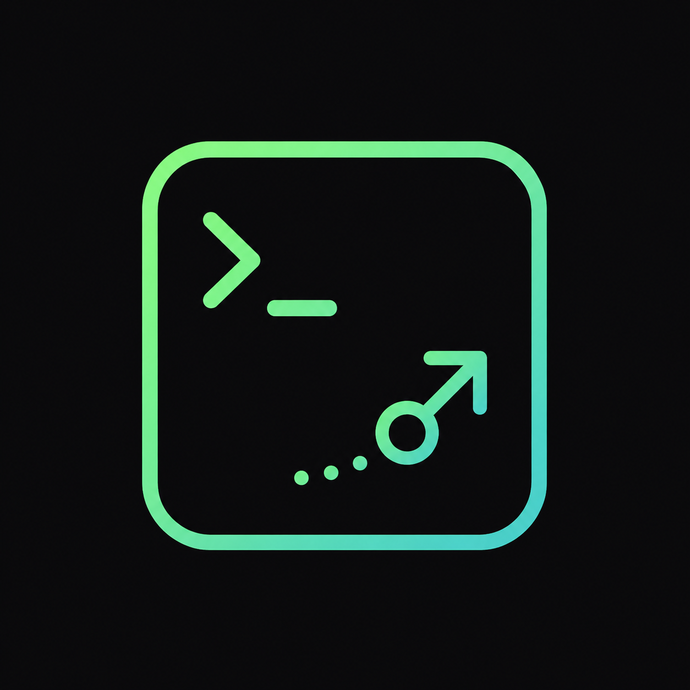
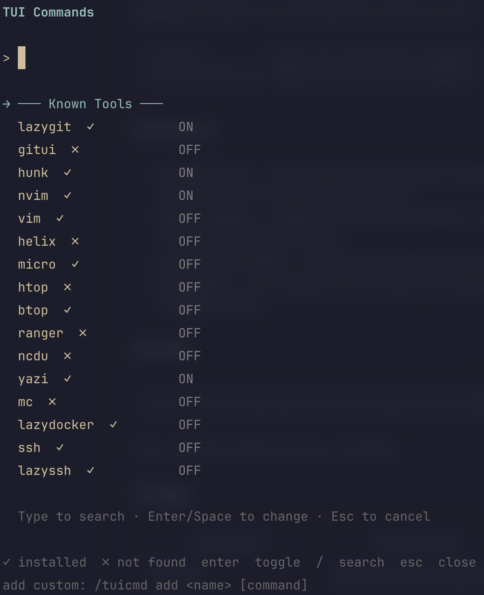

# pi-tui-commands

<p align="center">
  
</p>

Interactive `/` command registry for [pi](https://pi.dev). Register any TUI
tool (lazygit, nvim, htop, …) as a slash command that suspends pi while it
runs and restores pi when you quit.

```
/tuicmd           Open the interactive manager
/tuicmd add htop  Register /htop as a command
```



## Features

- **Interactive UI** — `/tuicmd` opens a searchable toggle list (like
  `/scoped-models`) showing all known tools, their install status (✓/✗),
  and your enabled set.
- **Binary checks** — Toggling a tool ON first checks if the binary exists
  on PATH. If not found, you get a message with a link to report the issue.
- **Custom commands** — Register anything with `/tuicmd add <name> [cmd]`.
- **Persistent** — Your enabled set and custom commands survive restarts
  (stored in `~/.pi/agent/tui-commands.json`).

## Install

```bash
pi install npm:pi-tui-commands
```

Then `/reload` inside pi and run `/tuicmd`.

## Usage

| Command                  | What it does                 |
| ------------------------ | ---------------------------- |
| `/tuicmd`                | Open interactive toggle list |
| `/tuicmd add lg lazygit` | Register `/lg` → `lazygit`   |
| `/tuicmd rm lg`          | Remove `/lg`                 |
| `/lazygit`               | (if enabled) Run lazygit     |

In the TUI:

- **Enter** toggles a tool ON/OFF
- **/** fuzzy-searches by name
- **Esc** closes

## How it works

When you toggle a tool ON, the extension:

1. Checks `which <binary>` to verify it's installed
2. Registers `/toolname` as a pi command via `pi.registerCommand()`
3. The command handler calls `ctx.ui.custom()` to stop the TUI, spawns the
   process with `stdio: "inherit"`, and restarts the TUI after the process
   exits

## Development

```bash
git clone https://github.com/hs094/pi-tui-commands
cd pi-tui-commands
pi -e ./extensions/tui-commands/index.ts
```

## License

MIT
